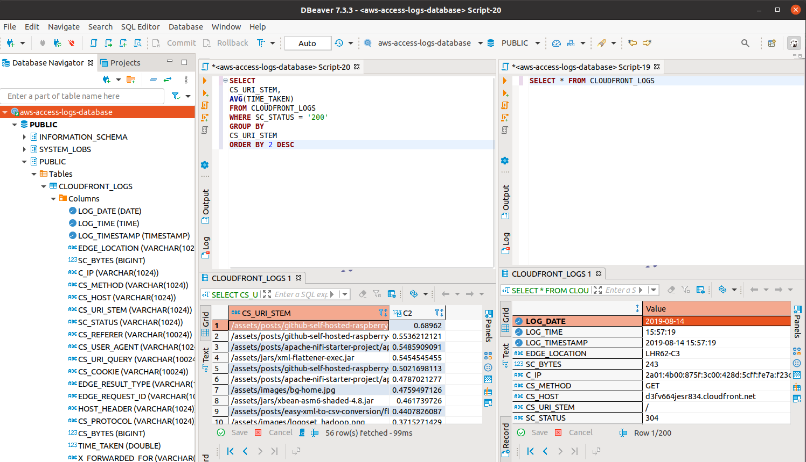
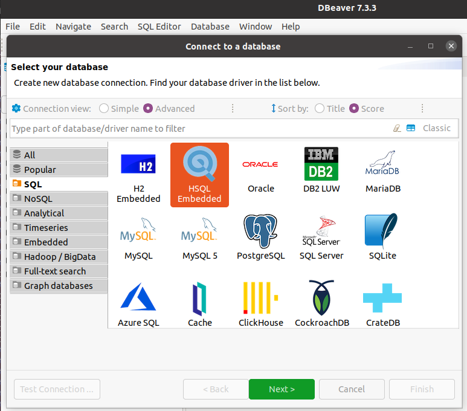
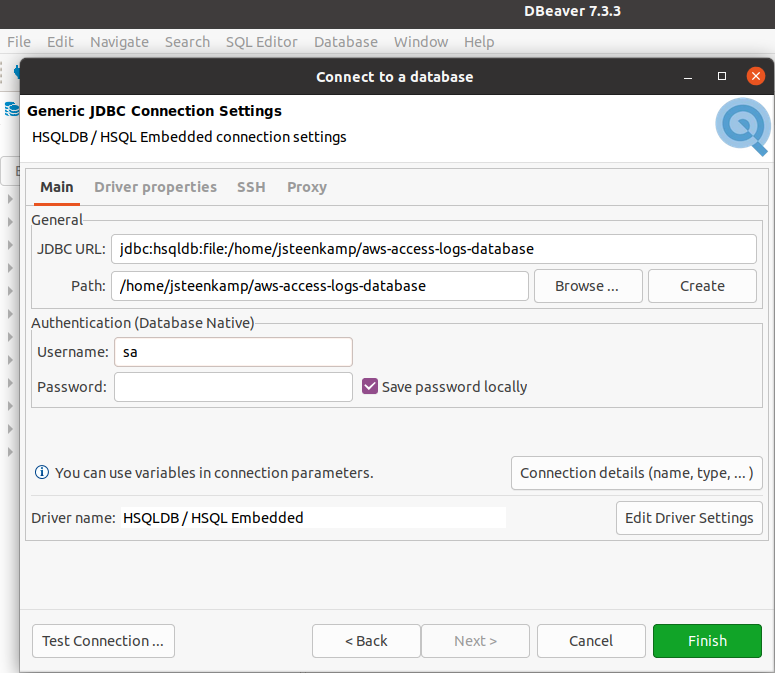

= AWS Cloudfront Logs Parser

The AWS Cloudfront logs parser is a utility that traverses a directory of https://docs.aws.amazon.com/AmazonCloudFront/latest/DeveloperGuide/AccessLogs.html[AWS Cloudfront log files] and converts it into a local relational database - http://hsqldb.org/[HSQLDB]



In essence, it is a simple, standalone utility that allowed the author to quickly get to a position to run some SQL queries against his log traffic and provided an excuse to try out some of the latest Java 15 features.

== Getting Started

=== Log Files Download

You need to make the AWS Cloudfront log files available in a location that can be read by the utility. To do this, you need to install the AWS command line interface - https://aws.amazon.com/cli/ - and configure it appropriately:

```
aws configure
```

Once this is completed, you can synchronize your remote AWS S3 log directory to a local path. For instance:

```
aws s3 sync s3://devworx.co.uk-access-logs .
```

=== Build the Utility

To build the utility, simply execute the standard https://maven.apache.org/[Apache Maven] build command:

```
mvn clean install
```

=== Run the Utility

The build will produce an executable JAR file - `target/cloudfront-exec.jar`. You can now build an HSQLDB file with the following command:

```
java --enable-preview -jar target/cloudfront-exec.jar /home/jsteenkamp/aws-access-logs  /home/jsteenkamp/aws-access-logs-database
```

Where:

* `/home/jsteenkamp/aws-access-logs` is the directory to where you have downloaded your AWS Cloudfront log files from S3
* `/home/jsteenkamp/aws-access-logs-database` is the directory / database to where you want to load these items into. This same URI will later be used to connect to the database through DBeaver.

=== Connect to the Database using DBeaver

Although you can use any tool that supports JDBC in order to connect to the HSQLDB file, in this example we will be using the excellent https://dbeaver.io/[DBeaver] product.

Once you have downloaded and started up the application, create a new connection and select HSQLDB Embedded:



Make sure your `Path` corresponds to where you created the database. The `Username` is `sa` while the `Password` is left blank.



When prompted to download the drivers, please do so. You are now ready to start querying the database.

=== Common Errors

==== Wrong Version of Java

If you encounter errors such as the ones listed below, you are not using Java 15+. Please ensure that you download an appropriate JDK from sites such as https://adoptopenjdk.net/ or https://www.azul.com/downloads/zulu-community/?package=jdk

```
(class file version 59.65535) was compiled with preview features that are unsupported. This version of the Java Runtime only recognizes preview features for class file version 55.65535
```

```
in project cloudfront-logs-java15: Fatal error compiling: error: invalid target release: 15 -> [Help 1]
```

==== Long Entries in Log File

During development, it was occasionally noticed that certain fields in the AWS log file were excessively large. For instance, the CS_URI_QUERY field would cause this exception on the database when running the script:

```
Caused by: java.lang.RuntimeException: Unable to execute the SQL Batch - got the exception : java.sql.BatchUpdateException: data exception: string data, right truncation;  table: CLOUDFRONT_LOGS column: CS_URI_QUERY - current count : 21000
	at uk.co.devworx.cloudfront.CloudfrontHSQLDBCreator.lambda$process$0(CloudfrontHSQLDBCreator.java:205)
	at uk.co.devworx.cloudfront.CloudfrontReader.tryAdvance(CloudfrontReader.java:115)
	... 70 more
Caused by: java.sql.BatchUpdateException: data exception: string data, right truncation;  table: CLOUDFRONT_LOGS column: CS_URI_QUERY
	at org.hsqldb.jdbc.JDBCPreparedStatement.executeBatch(Unknown Source)
```

This is almost certainly a corrupted request (hack attempt?). For now the approach has been taken to simply extend the size of the column in the table creation script - `src/main/resources/02-table-create-script.sql` :

```
CS_URI_QUERY                            VARCHAR(10024),
```

It may be the case that you encounter this for other fields also. If so, please reach out and let me know (we may want to put in a more permanent fix for this).


